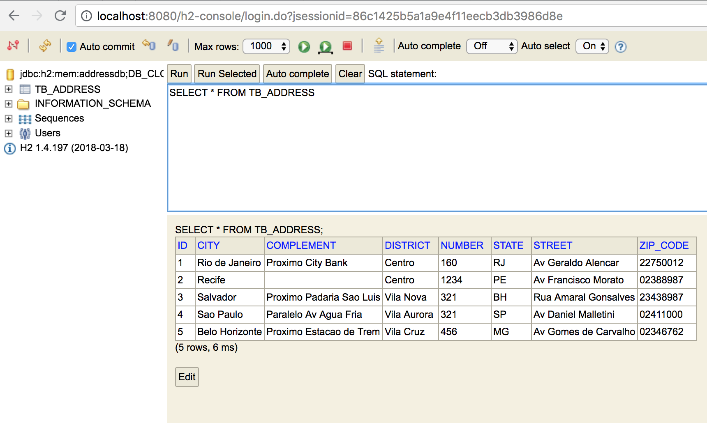

CRUD Address 
=============


Arquitetura
--

A aplicação foi dividida em Backend e Frontend visando desacoplar a API do console web.

Backend
--

> Spring Boot - para o gerenciamento das injeções de dependencias.


> RESTful Web Service - para o desenvolvimento da API

```java
@RestController
@CrossOrigin
@RequestMapping("/api/addresses")
public class AddressController {

    @Autowired
    private AddressService addressService;


    @GetMapping
    public ResponseEntity<List<Address>> getAll() {
        return ResponseEntity.ok(addressService.findAll());
    }
    
}
```

> Spring HATEOAS - para facilitar a criação de representações REST que seguem o princípio HATEOAS 

```
Address address = new Address();
address.add(linkTo(methodOn(AddressController.class).getById(address.getAddressID())).withSelfRel());
address.add(linkTo(methodOn(AddressController.class).delete(address.getAddressID())).withSelfRel());
```

> Bean Validation JSR-303 implementation - usado para a validação dos campos 

```
public class Address extends ResourceSupport {
    
    @NotEmpty(message = "O campo rua e obrigatorio!")
    private String street;
    
}


@PostMapping
public ResponseEntity<Address> create(@Valid @RequestBody Address address) {}

```

> Spring Data JPA - usado para a camada de persistencia

```java
@Repository
public interface AddressRepository extends CrudRepository<Address, Long> {

    Address findAddressByZipCode(String zipCode);

}
```

> H2 - Banco de dados utilizado em memoria para facilitar o desenvolvimento e setup da aplicação, contendo um arquivo data.sql que faz uma carga inicial da aplicação incluindo alguns endereços.





Frontend
--


> Angularjs - para facilitar a comunicação com a API, e controle do console web.

> Bootstrap - para facilitar a responsibilidade da parte web.

> Font Awesome - usado para adicionar icones na aplicação, visando um melhor desempenho pois em nenhum momento foi usado algum tipo de imagem jpeg ou png na aplicação.
 


Initial Setup
--

Access your terminal and run the following command line.

Step 1
-----

```
mvn clean install
```

Step 2
-----

```
java -jar target/address-api-0.0.1-SNAPSHOT.jar 
```

Step 3
-----

Access [http://localhost:8080/](http://localhost:8080/)

Result
--------------


